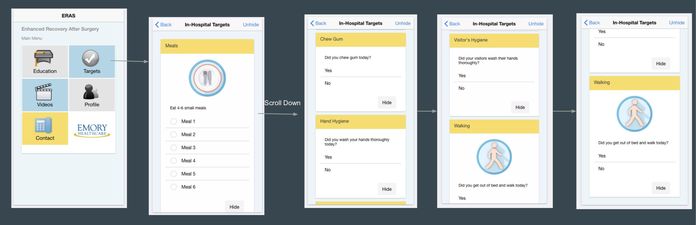
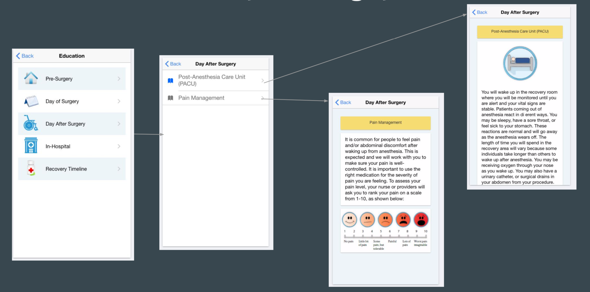
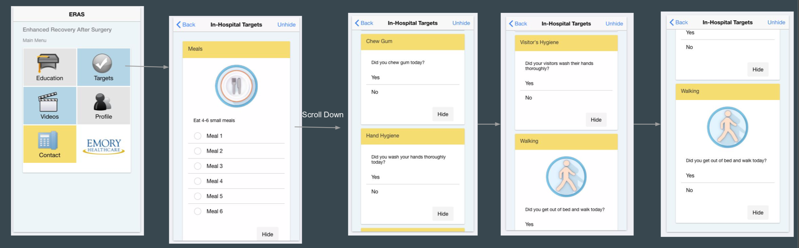
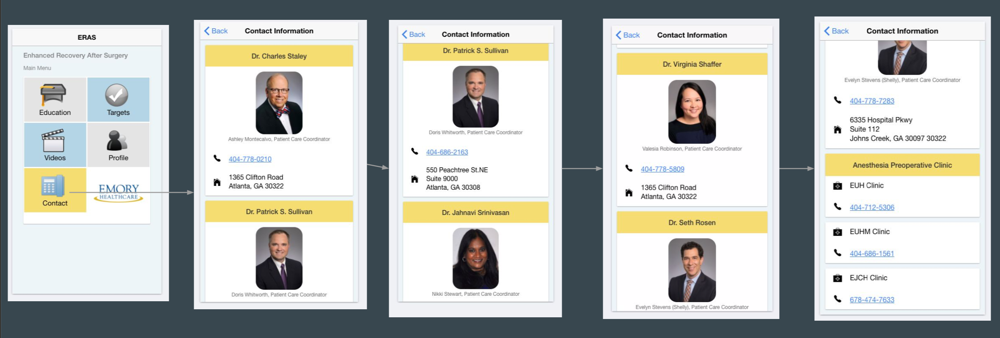

# ERAS-App-for-Patients

Cross-platform mobile app for colorectal surgery patients built using Ionic framework.

## Screenshots

### Questionnaire

### Patient Education

### Daily Targets

### Doctor Information

